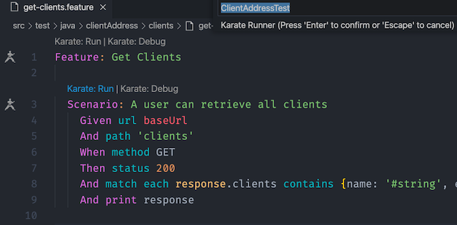
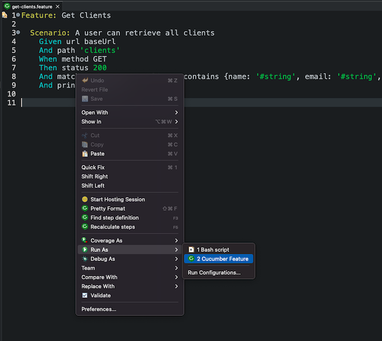

# Karate API Tests

## Overview

This project includes API Tests for the [Client-Manager](https://github.com/Scrump31/Client-Manager/tree/rtl-component-tests) repo.

## Getting Started

Clone or download the Client-Manager repo and install using the instructions in the [README](https://github.com/Scrump31/Client-Manager/blob/rtl-component-tests/README.md). You will need access to a [Mongo](https://www.mongodb.com/) database either locally or using a service such as [MongoAtlas](https://www.mongodb.com/atlas/database). If running the project using [VSCode](https://code.visualstudio.com/), please install the recommended extensions. [Eclipse IDE](https://www.eclipse.org/downloads/) is an excellent alternative if you choose not to use VSCode. The [Cucumber Eclipse Plugin](https://marketplace.eclipse.org/content/cucumber-eclipse-plugin) provides a great experience working with Karate in Eclipse.

## Running Tests

Before running tests, be sure the Client-Manager repo is up and running. If you are using VSCode with the recommended [Karate Runner](https://marketplace.visualstudio.com/items?itemName=kirkslota.karate-runner) plugin, you can click the `Karate:Run` link above any feature file as illustrated in the following image:

If you are using Eclipse, you can run tests by right-clicking the feature file and selecting "run as Cucumber feature" as illustrated in the following image:

Assuming you have [Maven](https://maven.apache.org/) installed on your system, you can run `mvn test` from the command line to execute all tests.

## Reports

Auto-generated test reports are stored in the `target` folder after each test run.
